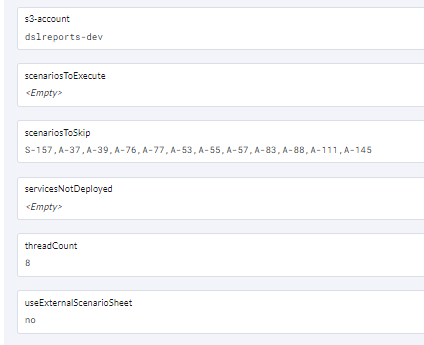
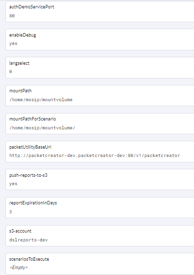
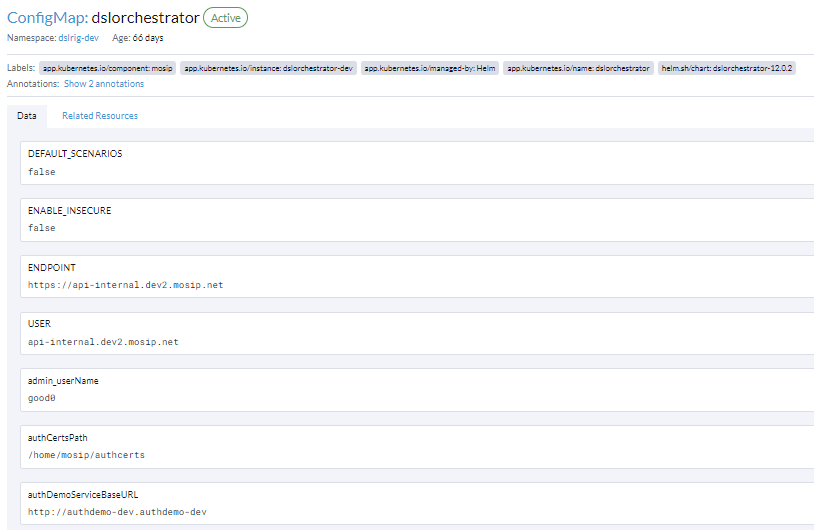

# DSL Test Rig Automation

A **Domain-Specific Language (DSL)** test framework is crafted specifically to facilitate thorough end-to-end testing of MOSIP functionalities. This framework empowers the specification and execution of test cases that accurately reflect real-world scenarios. These functionalities include:

* Registration
* Pre-registration + registration
* Authentication

**Execution Components and Flow**

<figure><figcaption></figcaption></figure>

## PacketCreator Service

The PacketCreator service, constructed with Spring Boot, is responsible for generating dummy data packets used in registrations. It employs `Mockmds` to fabricate realistic, simulated biometric information in the `cbeff` format, tailored to various use cases.

During deployment, the `PacketCreator` service can be configured to operate on a specific port or URL, providing flexibility in its deployment settings. In Rancher environments, this configuration is managed through ConfigMaps, allowing for seamless adjustment of deployment parameters.

Moreover, `PacketCreator` is equipped with the ability to concurrently execute multiple test scenarios, thereby optimising its operational efficiency.

Click [here](https://github.com/mosip/mosip-automation-tests) to know more about code and test data to run automation tests.

## AuthDemo Service

During deployment, the service can be configured to operate on a specific port or URL, a setup that is facilitated through the use of Config Maps in Rancher environments. Additionally, it includes functionality to generate partner P12 files, which are crucial for establishing secure communication channels.

Click [here](https://github.com/mosip/mosip-functional-tests) to know more about MOSIP repository for Functional Tests.

## DSL Orchestrator

The DSL test rig, also referred to as the DSL orchestrator, plays an important role in managing test data and executing the use cases outlined in scenario sheets. It harnesses the capabilities of `PacketCreator` and `AuthDemo` certificates to seamlessly orchestrate the complete scenario execution. Furthermore, the test rig is adept at concurrently running multiple scenarios, thereby maximizing efficiency.

Upon completion of execution, comprehensive reports are meticulously stored in a Minio S3 bucket, with the folder name specified in the configuration maps.

Click [here](https://github.com/mosip/mosip-automation-tests) to know more about test data to run automation tests.

## MockMds

`PacketCreator` establishes a connection with `Mockmds` through the Service Bus Interface (SBI). The SBI acts as a mediator and provides the port number (for example, 4501) used by `PacketCreator` to call `Mockmds` and access its cbeff generation utility for creating simulated biometric data.

## MountVolume

The MountVolume component is responsible for downloading and mounting specific folders from an NFS (Network File System) shared storage (/srv/nfs/mosip/testrig), which is accessible by both DSLtestrig and PacketCreator. These folders, namely:

* dsl-scenarios
* packetcreator-data
* packetcreator-authdemo-authcerts

<figure><figcaption></figcaption></figure>

Device certificates generated by `PacketCreator` are stored in the `packetcreator-authdemo-authcerts` folder.

<figure><figcaption></figcaption></figure>

Generated packets are stored in the following location for future retrieval.

<figure><figcaption></figcaption></figure>

A profile resource is utilized for each generated packet. This profile acts as a container for test data, including both demographic information and biometric details specific to the packet.

<figure><figcaption></figcaption></figure>

### Local Execution

For local execution of DSL scenario, follow these steps:

* Configure environment-specific secret keys in the Kernel.properties file located at: [Kernel.properties](https://github.com/mosip/mosip-automation-tests/blob/develop/mosip-acceptance-tests/ivv-orchestrator/src/main/resources/config/Kernel.properties).
* Set environment variables for each unique URL corresponding to different environments (e.g., development, test, production).
* Set centralized folder locally can be downloaded from the following location: [Centralized Folder](https://github.com/mosip/mosip-automation-tests/tree/develop/mosip-packet-creator/src/main/resources/dockersupport/centralized).
* Place the latest build JAR file in the packetcreator folder. Execute run.bat from the packetcreator folder to start the PacketCreator service.
* Place the latest build JAR file for the Auth Demo service. Ensure the service runs on the same port specified in the Kernel file.
* Identify the specific scenario numbers you want to execute by defining a configuration parameter like scenariosToRun. Assign a comma-separated list of scenario numbers. For a full suite execution, leave this parameter empty.
* Define another configuration parameter like scenariosToSkip to list the scenario numbers corresponding to known issues you want to exclude from execution. This allows focusing on new or relevant scenarios without re-running known problematic ones.

<figure><figcaption></figcaption></figure>

### Docker Execution Prerequisites

To ensure successful execution from Docker, please verify the following prerequisites:

* Ensure that the Authdemo pod is running and operational within the Docker environment.
* Confirm that the Packetcreator pod is deployed and operational within the Docker environment.
* Verify that the configuration maps for the DSL test rig are correctly set up and configured to facilitate communication and orchestration between components.

<figure><figcaption></figcaption></figure>

<figure><figcaption></figcaption></figure>

<figure><figcaption></figcaption></figure>

* Once the DSL test rig configuration maps are accurately configured, you can proceed to execute the DSL test rig pod within the Docker environment.
* Following execution, the comprehensive execution report will be made available in the Minio S3 bucket, accessible for retrieval and further analysis.

### Prerequisites for executing the DSL test rig

Before executing the DSL test rig, ensure the following prerequisites are met:

* **Globaladmin User Configuration**: The `globaladmin` user should be configured to point to either `Mycountry` or the root hierarchy within the user management system.
* **Keycloak Deployment**: Ensure a running Keycloak deployment is available to manage user authentication and authorization processes during test execution.
* **Network File System (NFS) Setup**: NFS must be properly configured and accessible to share data between relevant components, such as DSL test rig and PacketCreator.
* **PacketCreator and AuthDemo Paths**: Verify that the paths for both `PacketCreator` and `AuthDemo` in the configuration are accurately set, referencing their respective locations within the environment.
* **Scenario Sheet**: The scenario sheet containing test cases must have the correct scenario number(s) specified for execution.
* **Minio Bucket Access**: Confirm that the configuration maps hold valid information to access the Minio S3 bucket. This access is necessary for retrieving reports after the completion of the test run.

### How to analyse the report

Fetch reports from Minio as displayed below.



### Understanding DSL Test Reports

Here is the explanation of the different reports generated by the DSL test rig:

**ExtentReport**:

* Provides a summarized overview of executed scenarios and their outcomes (pass/fail).
* Each entry may include a brief description of failure if a scenario fails.
* Ideal for quickly identifying failing scenarios without diving into details.

**Detailed Testing Report**:

* Offers a comprehensive overview of each executed scenario.
* Allows searching for specific scenarios by their number.
* Displays the complete execution flow of a chosen scenario, starting from the beginning.
* Provides detailed logs and information about scenario execution and any encountered failures.
* Suitable for in-depth analysis of specific scenarios and understanding the root cause of failures.

**Pod Logs**:

* Contain detailed logging information generated by individual pods involved in the test execution (for example, DSL test rig, `PacketCreator`).
* Provide low-level details about system events, errors, and communication between components
* Recommended for advanced troubleshooting and identifying the root cause of complex failures.

### Writing New scenario

To write a new scenario using existing DSL steps for the DSL test rig, focusing on scenario number 2 and adapting it for a different flow, follow these steps:

**Analyze Existing Scenario 2**:

* Thoroughly analyze the existing scenario number 2 to understand its basic UIN generation flow.
* Identify the specific changes needed in the flow to adapt it for your new scenario.

**Leverage Existing Steps:**

* Review the existing DSL step definitions available in your test framework.
* Identify existing steps that align with your new scenario and can be reused.
* Re-using existing steps will save time and effort compared to building new steps from scratch.

**Create New Steps (if Necessary)**

* If your desired flow involves actions not covered by existing steps, create new DSL steps as needed.
* Ensure proper documentation and adhere to coding best practices when creating new steps.
* Organize the steps in the desired order of execution for your new scenario.
* Use existing steps where applicable and incorporate new steps as needed.

**Test and Refine**

Testing and refining the newly created scenario is crucial to ensure it functions correctly and produces the desired outcome. To test and refine, complete the following steps:

* Execute the newly created scenario within the DSL test rig environment.
* Verify that the scenario executes as expected and produces the desired outcome. Check for any errors or unexpected behaviour during execution.
* If necessary, debug and refine the scenario to address any issues or discrepancies encountered during execution.

**Additional Tips:**

* Start with a simple scenario to build confidence in your understanding of the DSL and scenario writing process.
* Consult colleagues who are familiar with the existing DSL and scenario definitions for guidance and support if needed.
* Document your new scenario clearly and concisely, explaining its purpose and any changes made compared to the original scenario.
* Below in the snapshot shown many more methods for your reference for the scenarios.

<figure><figcaption></figcaption></figure>

### Analyze the Scenario Names

To analyze scenario names effectively, consider the following strategies:

* Look for keywords or phrases within scenario step names that provide hints about their purpose or the information they handle. These keywords can offer insights into the actions or data manipulations performed by each step.
* Most DSLs come with documentation detailing their syntax, available steps, and structure. Refer to this documentation to understand the expected format and parameters for each step. It can provide clarity on the purpose and usage of individual steps.
* Test Scenarios Incrementally: Start by testing a simple scenario that involves only a few steps you understand. Gradually add complexity as you gain confidence in your understanding. This practice can help you identify potential gaps in your knowledge and where further investigation might be needed.

This documentation provides comprehensive guidance for utilizing and expanding the DSL Test Rig functionalities effectively.
