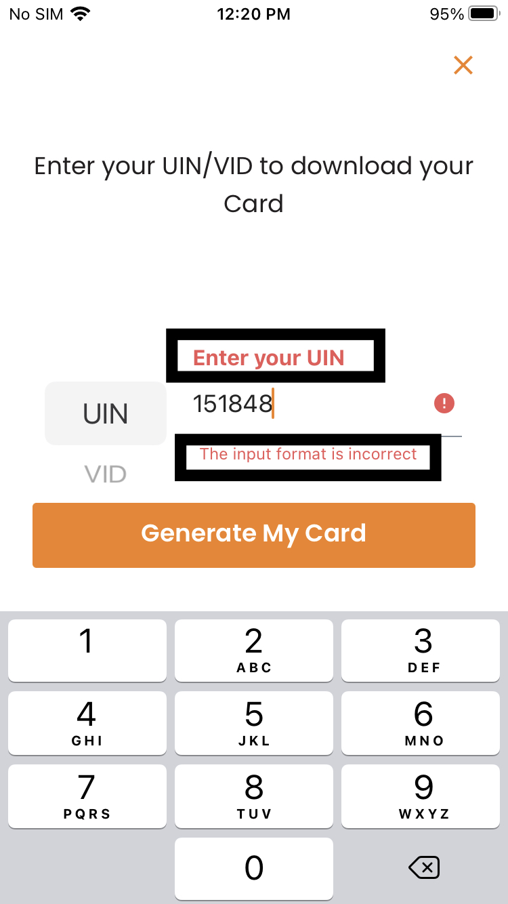
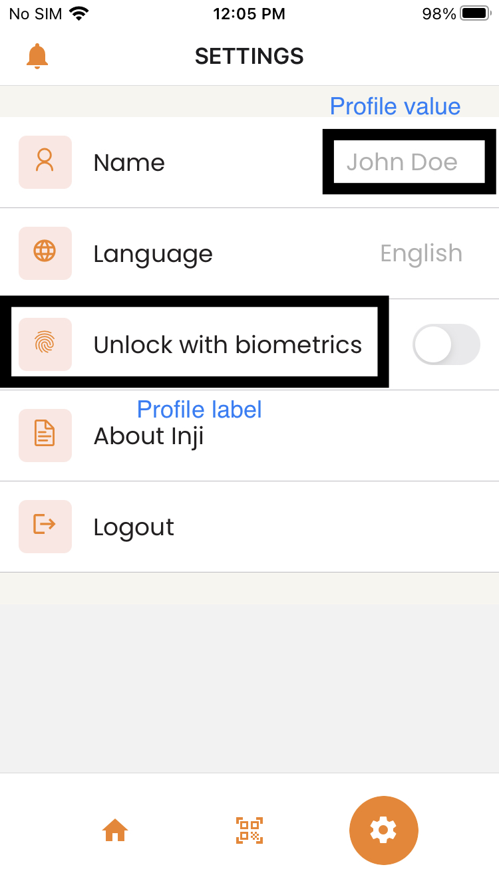
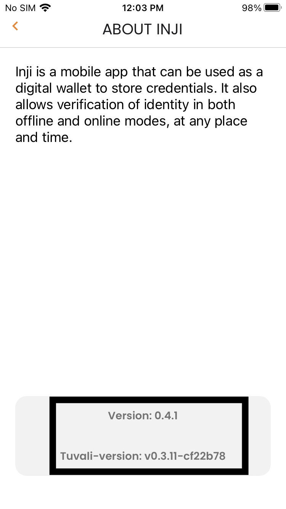

# UI Customization

## **CSS Themes**

Currently inji supports two themes:

- orange
- purple

We can customize the application by adding a new file under `components/ui/themes` and import that file in `components/ui/styleUtils.ts` and assign that file to `Theme` variable in it.

```
Example:-
    components/ui/styleUtils.ts

    import { PurpleTheme } from './PurpleTheme';
    export const Theme = PurpleTheme;
```

### **Logo and Background Images :**

To change the mosip logo:

```
MosipLogo = require(path of logo you want to use, in string format)

Example:-
MosipLogo = require('../../assets/mosip-logo.png')
```

To change the profile logo which is available as a demo while loading the vc details:

```
ProfileIcon = require(path of logo you want to use, in string format)

Example:-
ProfileIcon: require('../../assets/placeholder-photo.png')
```

To change the close card details background:

```
CloseCard = require(path of image you want to use, in string format)

-width: 363 pixels
-height: 236 pixels

Example:-
CloseCard: require('../../assets/ID-closed.png')
```

To change the OpenCard card details background:

```
OpenCard = require(path of image you want to use, in string format)

-width: 363 pixels
-height: 623 pixels

Example:-
  OpenCard: require('../../assets/ID-open.png')
```

### **Colors :**

To change the color of TabItemText:


```
export const DefaultTheme = {
  Colors: {
    TabItemText: colors.Orange,
    ...
  }
}
```

To change the color of Details Label Text:


```
export const DefaultTheme = {
  Colors: {
      DetailsLabel: colors.Orange,
    ...
  }
}
```

To change the color of Details Value Text:


```
export const DefaultTheme = {
  Colors: {
      Details: Colors.Black,
    ...
  }
}
```

To change the color of AddId Button Text and Background:


```
export const DefaultTheme = {
  Colors: {
     AddIdBtnBg: colors.Orange,
      AddIdBtnTxt: colors.Orange,
    ...
  }
}
```

To change the color of Icons:


```
export const DefaultTheme = {
  Colors: {
      Icon: colors.Orange,
    ...
  }
}
```

To change the Background Color of Icons:


```
export const DefaultTheme = {
  Colors: {
       IconBg: colors.Orange,
    ...
  }
}
```

To change the Color of Loading Transition:


```
export const DefaultTheme = {
  Colors: {
       Loading: colors.Orange,
    ...
  }
}
```

To change the Color of Error message:



```
export const DefaultTheme = {
  Colors: {
      errorMessage: Colors.Red,
    ...
  }
}
```

To change the Color of noUinText:


```
export const DefaultTheme = {
  Colors: {
       noUinText : colors.Orange,
    ...
  }
}
```

To change the Colors of profile Label and Profile values:



```
export const DefaultTheme = {
  Colors: {
     profileLabel: Colors.Black,
     profileValue: Colors.Grey,
    ...
  }
}
```

To change the Color of profileVersion:



```
export const DefaultTheme = {
  Colors: {
      profileVersion: Colors.Grey,
    ...
  }
}
```

---

## Locales

Libraries used -

- [i18next](https://www.i18next.com/)
- [react-i18next](https://react.i18next.com/)
- [expo-localization](https://docs.expo.dev/versions/latest/sdk/localization/)

Inji has the capability to support multiple languages.

`i18next` is an internationalization framework. It provides the standard i18n features such as [plurals](/translation-function/plurals), [context](/translation-function/context), [interpolation](/translation-function/interpolation), [format](/translation-function/formatting). It provides a complete solution to localize product from web to mobile and desktop.

`react-i18next` is a set of components, hooks, and plugins that sit on top of i18next, and is specifically designed for React.

`expo-localization` allows you to localise the app, customizing the experience for specific regions, languages. It also provides access to the locale data on the native device.

Below are the steps to support a new language -

- Under `locales` folder, localisation of particular language json file has to be added.
- Language json has to be imported in `i18n.ts` and load the resources to i18next as follows.
  `import  fil  from  './locales/fil.json';`
  `const  resources  =  {  en, fil,  ar,  hi,  kn,  ta  };`
- To ensure the language needs to be included in const `SUPPORTED_LANGUAGES`.
  `const  {  t  }  =  useTranslation('common');`
- To use with react, must include key with 't' function
  `<Text>{t('editLabel')}</Text>`
