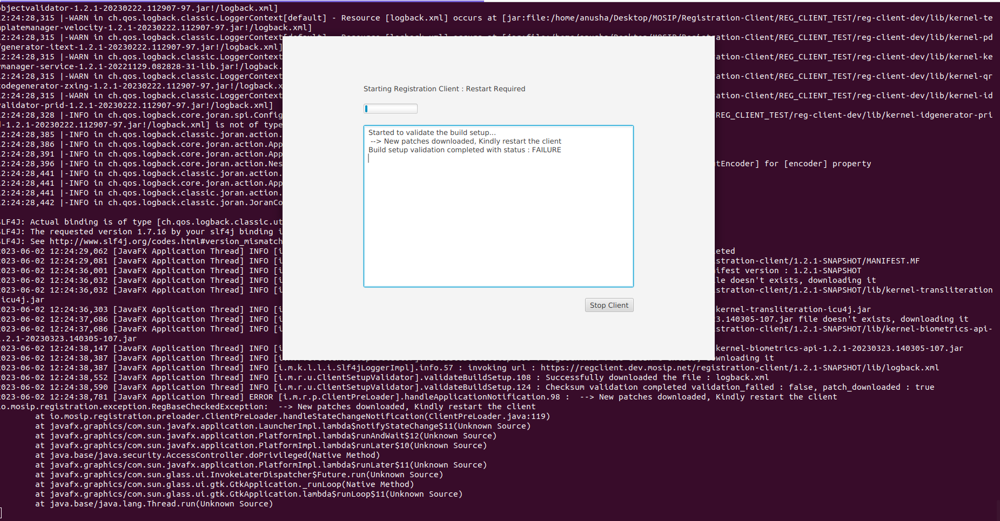
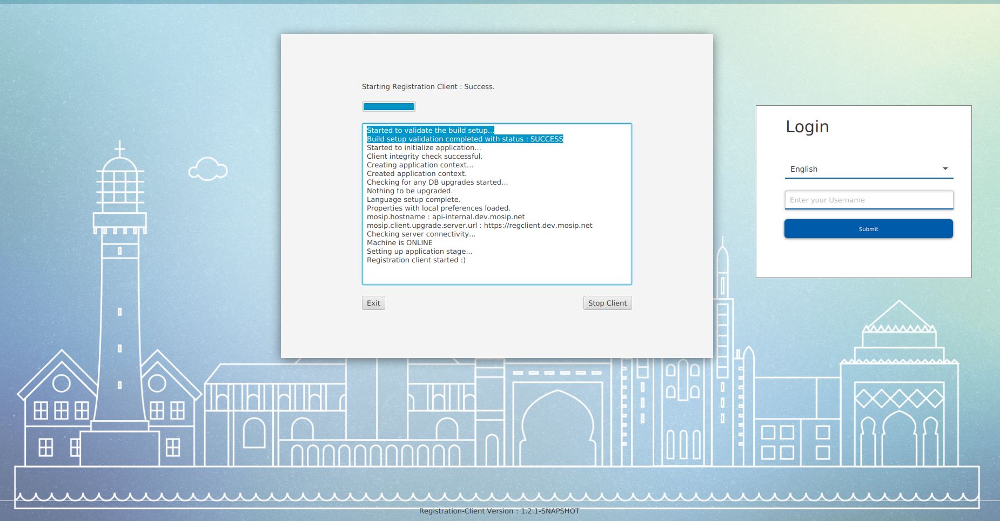

# Registration Client Upgrade

The Registration Client Docker serves as a registration client zip downloader and upgrade server. The Nginx server within the Registration Client Docker container provides all necessary artifacts and resources during the upgrade process.

**Patch updates**:

* When the registration client is launched, it downloads the manifest file from the upgrade server if the machine is online. Otherwise, it uses the local manifest file.
* The client compares the checksum of each JAR file in the lib directory with the checksum stored in the manifest file. If there's a mismatch, the client considers the file invalid and deletes it before downloading it from the client upgrade server.
* A checksum mismatch may be intentional for the rollout of hotfixes in the libraries used by the registration client or in the registration-client and registration-service module.
* Patch updates do not support the upgrade of local Derby DB.

**Assumption**:

* No major or minor version changes should occur for registration-client and registration-services modules.
* Registration clients must be online to receive patch updates.

**To roll out patches**:

* Rebuild the Registration Client Dockerfile and publish it with the same version.
* Restart the registration client pod in Rancher.

**For slow connections or connection failures**:

* If the client fails to download the manifest file when the machine is online, the registration client application will exit and report a build status check failure in the pre-loader screen.
* If the latest manifest file is successfully downloaded but fails to download all the patches, the registration client application will exit and report a patch download failure.
* In both cases, the operator/supervisor must restart the registration client application with a stable network connection. Upon restart, the client application will repeat the check from the server and continue the patch update.

> Patch updates can include updates to existing libraries and the addition of new files. However, they are only applied to files in the `lib` directory.

**Note**: Deleting the `registration-client.jar` or `registration-services.jar` is not recoverable.

<figure><figcaption><p>On patch download, the pre-loader screen displays <strong>Restart required</strong></p></figcaption></figure>

<figure><figcaption><p>Successful restart of the Registration Client application</p></figcaption></figure>

## Version upgrade

This procedure entails upgrading from one version of the software to the next iteration.

Additionally, this may involve upgrading local derby databases.

Upon each launch of the registration client, the client retrieves the `maven-metadata.xml` file from the client upgrade server. The version specified in the local manifest file is then compared to the initial version element found in the `maven-metadata.xml`.

Should the version values differ, the client recognizes it as an available upgrade to a new version.

```
<metadata>
<groupId>io.mosip.registration</groupId>
<artifactId>registration-services</artifactId>
<versioning>
<versions>
<version>1.2.0.1</version>
</versions>
<lastUpdated>20200729125958</lastUpdated>
</versioning>
</metadata>
```

Above is the sample content of `maven-metadata.xml`.

The version upgrades are not performed automatically and must be initiated by the operator or supervisors. The process for the version upgrade can be outlined as follows:

1. Backup the database, libraries, binary, and manifest files and folders.
2. Download the latest JAR files and manifest files from the upgrade server to the local machine.
3. Prompt the operator/supervisor to restart the registration client with the upgraded JAR files.
4. Upon restart, the application executes the database upgrade scripts.
5. If the execution of the upgrade scripts is successful, the registration client starts and the version upgrade process is considered complete.
6. In the event of failure, rollback scripts for the database are executed and the registration client application exits. The operator/supervisor must rerun the registration client to initiate the execution of the upgrade database scripts.
7. Once the version upgrade process is successfully completed, the backup folder is removed and the registration client is fully functional for use.

From version 1.1.5.5 and above, the registration client now has the ability to upgrade directly from one version to another without going through the versions in between.

To enable this upgrade process, a new configuration has been introduced. This configuration is required for the upgrade to any higher version. The configuration key that needs to be set is `mosip.registration.verion.upgrade.version-mappings`.

The version-mappings configuration specifies the list of released versions of the registration client, their respective release order, and the database scripts folder name.

For example, to upgrade from version 1.1.4 to version 1.1.5.5, the configuration should be specified as follows:

```
mosip.registration.verion.upgrade.version-mappings={ "1.1.4":{ "dbVersion":"1.1.4", "releaseOrder":1}, "1.1.5":{ "dbVersion":"1.1.5", "releaseOrder":2}, "1.1.5.5":{ "dbVersion":"1.1.5.5", "releaseOrder":3} }
```

This configuration needs to be specified in the `spring.properties` file of the registration-services.

During the registration client upgrade process, the application retrieves the above configuration and initiates the database upgrade based on the specified list of versions.

The upgrade progresses according to the `releaseOrder` and executes the necessary database scripts based on the `dbVersion` value.

**How to roll out version upgrades?**

In rancher,

* Delete the existing version helm deployment of the registration client.
* Deploy the new version of the registration client helm chart.

**Example**:

Let us assume that the registration-client version 1.1.5.5 is currently running, and we have to upgrade to version 1.2.0.1 version.

_What happens after deploying the 1.2.0.1 version registration client in rancher?_

Registration clients downloading the `maven-metadata.xml` from the upgrade server will be aware of the new version availability.

content:

```
<metadata>
<groupId>io.mosip.registration</groupId>
<artifactId>registration-services</artifactId>
<versioning>
<versions>
<version>1.2.0.1</version>
</versions>
<lastUpdated>20200729125958</lastUpdated>
</versioning>
</metadata>
```

Based on the first version available in the `maven-metadata.xml`, registration client will next download the `MANIFEST.MF`.

After the successful download of the manifest file, the registration client will start the download of all the new files, updates the existing file if the hash is mismatched, and deletes the unused files from the lib directory.

After completing the download, operator/supervisor will be prompted to restart the registration client.

Next restart, will start the registration client as version 1.2.0.1 and starts the DB upgrade script execution if present based on the version-mappings configuration available.

The status of the DB script execution is printed on the preloader screen and also logged into `registration.log`.

## Backups and rollbacks

During the version upgrade process, we create backups of the manifest, db, lib, and bin folders in the designated backup directory. Once the upgrade is completed successfully, the backups are cleared. However, if the upgrade fails, we only roll back the changes made to the database.

In the event that the registration client application gets stuck during the upgrade due to errors or failures in the background, it is necessary for the operator or supervisor to manually roll back to the previous version of the registration client.

Below are the steps for manually rolling back:

#### 1.1.4.\* to 1.1.5.5 / 1.1.4.\* to 1.2.0.\*

1. Close the registration client application.
2. Delete the `db` and `.mosipkeys` folders in the reg-client working directory.
3. Navigate to the designated backup directory, where you will find a folder named after the previous version and the timestamp when it was created. For example, "1.1.4.4\_2023-05-30 13-00-27.238Z".
4. Copy all the files and folders (lib, bin, MANIFEST.MF) from the backup to the registration client working directory, except for the `.mosipkeys` folder.
5. Copy the `.mosipkeys` folder from the backup to the home directory of the current user.
6. Launch the registration client application again.

#### 1.1.5.5 to 1.2.0.\*

1. Close the registration client application.
2. Delete the `db` folder, if it exists, in the registration client working directory.
3. Navigate to the designated backup directory, where you will find a folder named after the previous version and the timestamp when it was created. For example, "1.1.5.5\_2023-05-30 13-00-27.238Z".
4. Copy all the files and folders (`lib, bin, MANIFEST.MF`) from the backup to the registration client working directory.
5. Launch the registration client application again.

By following these steps, the registration client application will be successfully rolled back to its previous version.
