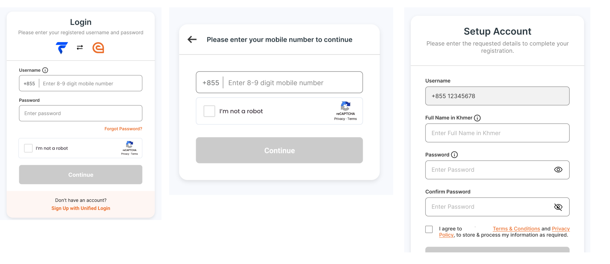

# Sign Up Service

eSignet serves as an authentication layer for relying parties, offering various authentication methods aligned with functional identity and stored credentials. Integration with the ID Authentication service and ID repository under MOSIP allows the migration of existing accounts or the creation of new user accounts and credentials.

## Sign Up Service

* Generates ID objects based on the user inputs.
* Shares ID object with ID repository for account creation.

## ID Repository

* Maintains the [identity object schema](https://docs.mosip.io/1.2.0/id-lifecycle-management/id-schema).
* Validates declared Handle and Password objects.
* For more details, visit [ID Repository](https://docs.mosip.io/1.2.0/modules/id-repository).

## ID Authentication Service

* Manages user credentials
* Validates uniqueness of handle
* Validates end-user login requests
* Explore [ID Authentication](https://docs.mosip.io/1.2.0/id-authentication)

<figure><figcaption></figcaption></figure>

## How It Works?

* Sign Up service shares the user selected Handle, Password and other details as an Identity object to the ID Repository.
* In ID Repository, using ID schema validates Identity object and identifies valid selected Handles.
* ID repository shares selected Handles with ID Authentication to create credential for each.
* IDA service verifies, if the hash of the Handles is unique before creating corresponding credentials.

## Sign Up User Flow

<figure><figcaption></figcaption></figure>
