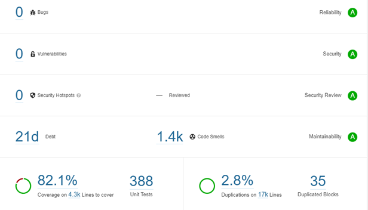

# Test Report

## Scope

The scope of testing revolved around verifying the compliance of the product as per the specifications published by MOSIP using the below devices:

The Windows Compliance tool kit was tested with the below specifications:

* **ABIS (Automated Biometric Identification System)** Specifications were tested with Fingerprint, Iris and Face modalities as per [MOSIP ABIS API](https://docs.mosip.io/1.2.0/biometrics/abis-api) specifications.
* **Secure Biometric Interface (SBI)** with Compliance testcases collection and Quality Assessment testcases collection on below modalities
  * Registration devices for Iris, Face and Fingerprint
  * Authentication devices for Iris, Face and Fingerprint
* **Biometric SDK**
  * Quality Check
  * Match
  * Extraction
  * Conversion

The Android Compliance tool kit app v1.4.0 was tested with the below specifications:

* **Secure Biometric Interface (SBI)** with Compliance testcases collection and Quality Assessment testcases collection on below modalities
  * Registration devices for Iris, Face and Fingerprint
  * Authentication devices for Iris, Face and Fingerprint

## Test Execution Statistics

### ABIS Testing

MOSIP interfaces with an Automated Biometric Identification System (ABIS) to perform de-duplication of a resident's biometric data. A country may use multiple ABISs for the same biometric data and evaluate the best ABIS based on de-duplication quality. ABIS is used for 1:N de-duplication. For 1:1 authentication, Biometric SDK is used. MOSIP does not recommend using an ABIS for 1:1 authentication.

Test cases have been tested with MOSIP mock ABIS for compliance with the MOSIP specifications across 29 test cases.

| **Scenarios**     | **Mock ABIS** |
| ----------------- | ------------- |
| Total             | 28            |
| Passed            | 27            |
| Pending           | 0             |
| Failed            | 0             |
| NA                | 1             |
| **Test Rate (%)** | 100%          |
| **Pass Rate (%)** | 100%          |

_Out of scope_: Real ABIS testing in CTK 1.4.0

### SBI Testing

The Secure Biometric Interface (SBI) is used to interface with biometric devices. The compliance tool kit was tested to ensure that the interface built by the device provider is following the specs and security rules defined in the SBI spec. The device hardware security features are not tested as part of compliance tool kit.

#### For Android Authentication Devices using MOSIP's Android mock SBI

The ‘Android CTK app v1.4.0’ with ‘MOSIP Android Mock SBI’ has been tested for compliance with the specifications. Test cases specific to quality and user interactions have been tested with MOSIP Android mock SBI.

| **Scenarios**     | **Finger** | **Iris** | **Face** |
| ----------------- | ---------- | -------- | -------- |
| Total             | 35         | 27       | 41       |
| Passed            | 35         | 27       | 41       |
| Pending           | 0          | 0        | 0        |
| Failed            | 0          | 0        | 0        |
| **Test Rate (%)** | 100%       | 100%     | 100%     |
| **Pass Rate (%)** | 100%       | 90%      | 100%     |

#### For Android Registration Devices using MOSIP's Android mock SBI

The `Android CTK app v1.4.0` with `MOSIP Android Mock SBI` has been tested for compliance with the specifications. Test cases specific to quality and user interactions have been tested with MOSIP Android mock SBI and real registration face SBI.

| **Scenarios**     | **Finger** | **Iris** | **Face** |
| ----------------- | ---------- | -------- | -------- |
| Total             | 49         | 26       | 45       |
| Passed            | 49         | 26       | 45       |
| Pending           | 0          | 0        | 0        |
| Failed            | 0          | 0        | 0        |
| **Test Rate (%)** | 100%       | 100%     | 100%     |
| **Pass Rate (%)** | 100%       | 100%     | 100%     |

#### For Windows Authentication Devices using MOSIP's Windows mock SBI

The Windows CTK 1.4.0 with `MOSIP windows Mock SBI` has been tested for compliance with the specifications.

| **Scenarios**     | **Finger** | **Iris** | **Face** |
| ----------------- | ---------- | -------- | -------- |
| Total             | 35         | 27       | 41       |
| Passed            | 35         | 27       | 41       |
| Pending           | 0          | 0        | 0        |
| Failed            | 0          | 0        | 0        |
| **Test Rate (%)** | 100%       | 100%     | 100%     |
| **Pass Rate (%)** | 100%       | 100%     | 100%     |

#### For Windows Registration Devices using MOSIP's windows mock SBI

The Windows CTK 1.4.0 with `MOSIP windows Mock SBI` has been tested for compliance with the specifications.

| **Scenarios**     | **Finger** | **Iris** | **Face** |
| ----------------- | ---------- | -------- | -------- |
| Total             | 55         | 29       | 48       |
| Passed            | 55         | 29       | 48       |
| Pending           | 0          | 0        | 0        |
| Failed            | 0          | 0        | 0        |
| **Test Rate (%)** | 100%       | 100%     | 100%     |
| **Pass Rate (%)** | 100%       | 100%     | 100%     |

_Out of scope_: Real devices testing on Windows and android CTK v1.4.0.

### SDK Testing

The SDK implementation has been tested to support quality check, match, extraction, and conversion of biometrics. Test cases have been tested with MOSIP mock SDK.

| **Scenarios**     | **With Mock SDK** |
| ----------------- | ----------------- |
| Total             | 65                |
| Passed            | 65                |
| Pending           | 0                 |
| Failed            | 0                 |
| **Test Rate (%)** | 100%              |
| **Pass Rate (%)** | 100%              |

_Out of scope_: Segmentation testing and Real SDK testing.

### Docker version (required for Compliance Tool Kit)

mosipqa/compliance-toolkit-batch-job:1.4.0

mosipqa/compliance-toolkit-service:1.4.0

mosipqa/compliance-toolkit-ui:1.4.0

mosipqa/postgres-init:develop

mosipid/config-server:1.1.2

mosipid/kernel-auditmanager-service:1.2.0.1-B1

mosipid/kernel-auth-service:1.2.0.1-B2

mosipqa/authentication-internal-service:release-1.2.0.1

mosipqa/authentication-otp-service:release-1.2.0.1

mosipqa/authentication-service:release-1.2.0.1

mosipid/kernel-keymanager-service:1.2.0.1-B2

mosipqa/keycloak-init:develop

mosipid/partner-management-service:1.2.0.1-B3

mosipqa/partner-onboarder:develop

mosipid/kernel-notification-service:1.2.0.1-B1

### Known Issues

**ABIS Partner Can Create SBI and SDK Projects**

* Currently, ABIS partners can successfully create SBI and SDK projects in CTK 1.4.0, although role-based constraints to restrict this functionality is planned for future release.

### Sonar Report

#### MOSIP - Compliance-toolkit-service

<figure><figcaption></figcaption></figure>

#### MOSIP - compliance-toolkit-ui

<figure><figcaption></figcaption></figure>
