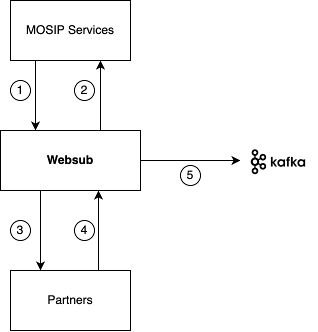

# WebSub

## Overview
WebSub provides a common mechanism for communication between publishers of any kind of Web content and their subscribers, based on HTTP web hooks. Subscription requests are relayed through hubs, which validate and verify the request. Hubs then distribute new and updated content to subscribers when it becomes available. WebSub was previously known as PubSubHubbub. See [W3C WebSub](https://www.w3.org/TR/websub/).

## WebSub in MOSIP
In MOSIP WebSub is used to share data with services and partners.  [Kafka](https://kafka.apache.org/) message broker has been used to implement the WebSub APIs. Message brokers are a natural fit for the implementation of WebSub hubs as they serve a similar purpose.

Refer [WebSub repo](https://github.com/mosip/websub/tree/1.2.0-rc2) for further details.

