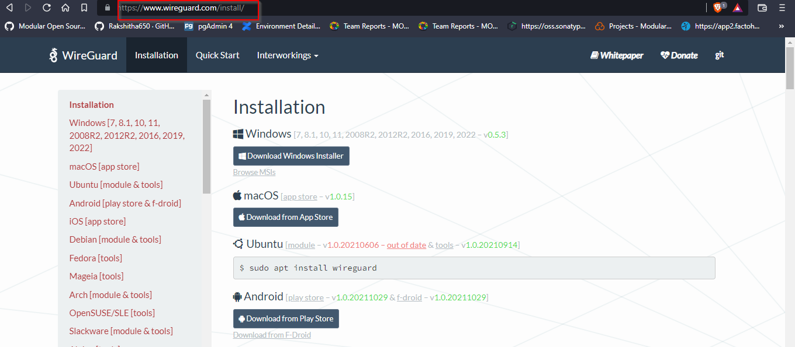
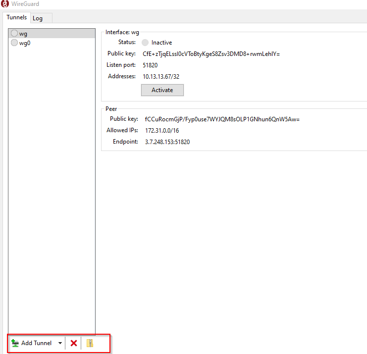
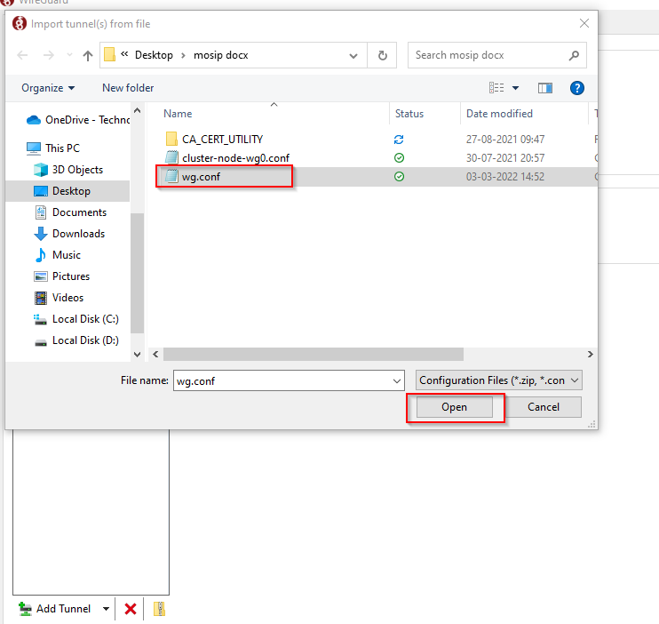
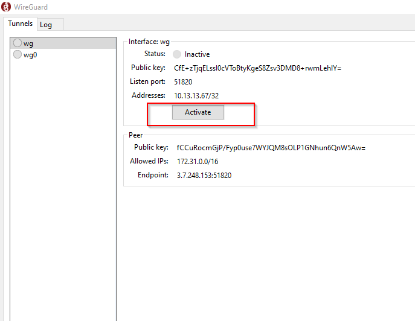

# Wireguard Client Installation Guide

## Overview
V3 installation uses wireguard for secure access. This document helps in the installation of wireguard on your machine.

### Steps to install wireguard
1. Visit the [link](https://www.wireguard.com/install/) to download the wireguard installer.

2. Once the installation is successful, launch the wireguard application.

3. Click **Add Tunnel** and select the `wg.conf` file shared with you.

4. Click **Activate** to activate the wireguard.

