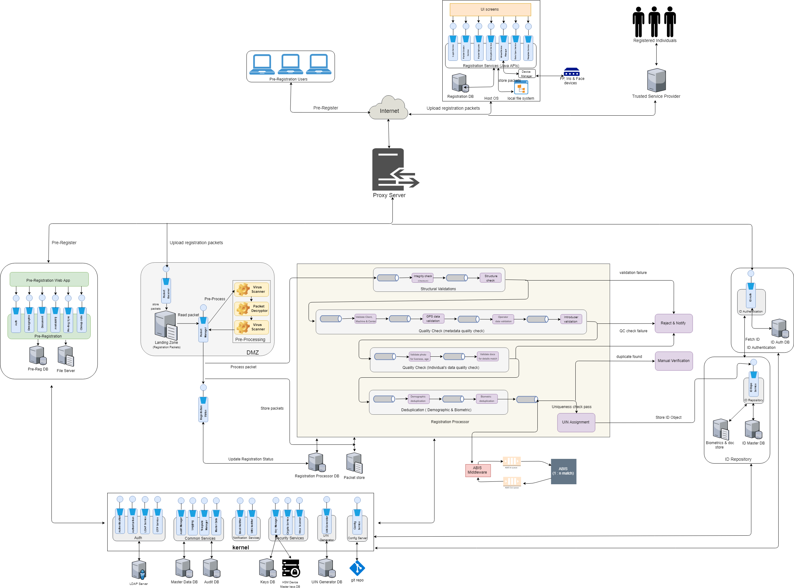

# MOSIP Architecture

The Modular Open Source Identity Platform (MOSIP) helps Governments and other user organizations implement a digital, foundational identity system in a cost effective way. Nations can use MOSIP freely to build their own identity systems. Being modular in its architecture, MOSIP provides flexibility to countries in how they implement and configure their systems, and helps avoid vendor lock-in.

MOSIP provides the following basic features - 
* acquire an individual's identity data
* process the identity data to establish uniqueness
* generate a Unique Identity Number (UIN)
* authenticate an individual's identity where required to provide access to services such as healthcare, education, social security etc. 

The key objectives of the platform are to - 
* provide the basic framework to create a fully functional identity system
* provide the flexibility for a country to choose the features from the basic framework according to their requirements
* maintain the privacy, security and confidentiality of an individual's data
* provide a scalable and accessible solution to cater to a wide range of population (a few thousands to tens of millions)

## Architectural Principles

MOSIP is built on the following architecture principles

* MOSIP must not use proprietary or commercial license frameworks. Where deemed essential, such components must be encapsulated to enable their replacement if necessary (to avoid vendor lock-in)
* MOSIP must use open standards to expose it’s functionality (to avoid technology lock-in)
* Each MOSIP component must be independently scalable (scale out) to meet varying load requirements
* MOSIP must use commodity computing hardware & software to build the platform
* Data must be encrypted in-flight and at-rest. All requests must be authenticated and authorized. Privacy of Identity Data is an absolute must in MOSIP
* MOSIP must follow platform based approach so that all common features are abstracted as reusable components and frameworks into a common layer
* MOSIP must follow API first approach and expose the business functions as RESTful services
* MOSIP must follow the following manageability principles – Auditability & monitor ability of every event in the system, testability of every feature of the platform & easy upgrade ability of the platform
* MOSIP components must be loosely coupled so that they can be composed to build the identity solution as per the requirements of a country
* MOSIP must support i18n capability
* All modules of MOSIP should be resilient such that the solution as a whole is fault tolerant
* The key sub-systems of MOSIP should be designed for extensibility. For example, if an external system has to be integrated for fingerprint data, it should be easy to do so

The key design aspects considered for MOSIP are

### Ecosystem approach
MOSIP on its own will not be able to meet the end-to-end requirements of a country. Devices and ABIS providers are key to process an individual's data and prove uniqueness. MOSIP should be able to integrate with devices and ABIS that conform to the standards to achieve the stated goals. MOSIP should also be able to cater to a diverse set of institutions wanting to authenticate an Individual against the data stored in MOSIP.
So, key parameters are
* All public/external facing interfaces of MOSIP must be standards-based for interoperability

### Configurability
MOSIP should be flexible for countries to configure the base platform according to their specific requirements. Some of the examples of configurability are
* Country should be able to choose the features required. For example, it must be possible for a country to turn off Finger Print capture
* Country should be able to configure the attributes of an ID Object
* Country should be able to define the length of the UIN number

### Extensibility
MOSIP should be flexible to extend functionality on top of the basic platform. Some of the examples of extensibility are
* A country should be able to introduce a new step in processing data
* Integrate MOSIP with other ID systems and include it as part of the MOSIP data processing flow

### Modularity
All components in MOSIP should be modular and their features exposed via interfaces such that the implementation behind the interface can be changed without affecting other modules. Some examples of modularity are
* UIN generator algorithm provided by the platform can be replaced by a country with their own implementation
* The default demographic deduplication algorithm provided by MOSIP can be changed to a different one without impacting the process flow

## Logical Architecture

* Microservice based architecture for all platform services
    * Services must be stateless to scale out horizontally
    * Services must be idempotent
    * Services must have well defined interfaces

This will help achieve modularity, better maintainability and scalability.

* Staged Event Driven Architecture (SEDA) for processing Registration data
    * Each processing step must be a stage
    * Stages must be connected with event bus
* Process flow must be configured outside code

This will help achieve extensibility and scale out stages independently.

* Thick client architecture for Registration client
    * Client must run on a desktop/laptop in offline mode also
    * Client must integrate with devices in a secure manner

## Data Architecture

### Open Source and Vendor Neutral

To handle vendor neutrality and open source, the following consideration are followed while designing the data model and the database design.

+ No business logic is applied at database level: Database will be used only to store and retrieve data. There is no business logic applied at database level other than Primary / Unique key, Not null and foreign keys. Foreign keys are applied within the same database, if a table is referenced in another database then no FK is applied. 

+ No specific database features to be used: Features that are common across databases which are compliant with open source standards are applied. 

+ All DDL, DML and DQL statements will follow ANSI standards

+ Metadata approach to handle complex and flexible data structures

+ Only following datatypes are being used
    - Character varying
    - Timestamp
    - Date
    - Integer
    - Number
    - Bytea/blob
    - Boolean

### Multi-Language

MOSIP platform is being built for multiple countries, there is a need to support multiple languages. So as per the requirements, MOSIP will support 3 languages as configured by the country level administrator.
Multi language support is needed for the following datasets. 

* Master Data
* ID data of an individual
* Transaction comments
* Labels used in UI
* Messages and notifications

From database side, the data will support **UTF-8 Unicode character set** to store data entered in multiple languages. 
There will not be any in-built support to translate data at database level. Any translation or transliteration will be handled at API or UI layer.

### High Performance

To support high performance, following database design features are to be considered

* Database sharding is applied on uin dataset. By default, base sharding algorithm will be applied in MOSIP system. SI can define the sharding algorithm based on the deployment setup
* All tables will have a primary key index on the primary key field. This will help in faster retrievals and joins
* All foreign keys will have indexes defined so that it will help in faster joins
* No referential integrity is applied on tables across databases
* Partitioning: Partitioning design to be discussed as PostgreSQL has certain limitation / different way of implementation that requires specific database features to be applied. To be discussed further to finalize the implementation of this feature.

