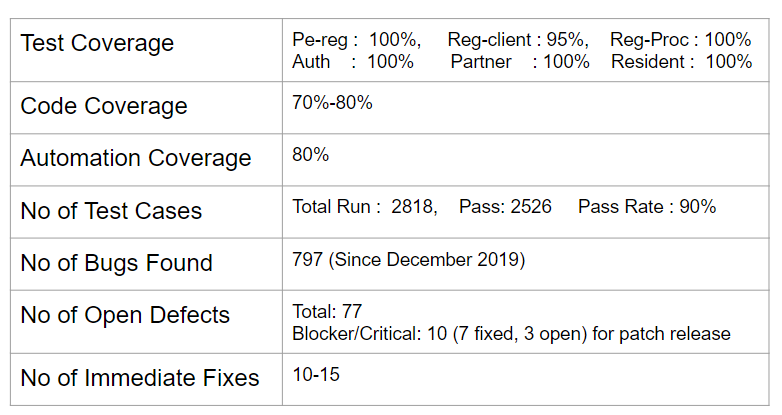
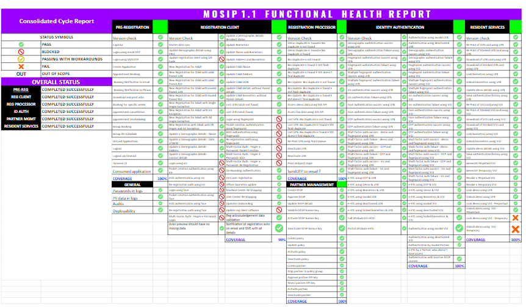

## Test Reports 
**Testing Scope**
#### 1. In scope 

|Title	|Description|
|------|------|
|Functional Testing|<ul><li>Pre-registration (UI & APIs)</li><li>Registration Client</li><li>Kernel (APIs)</li><li>Registration Processor (Server)</li><li>ID Authentication (APIs)</li><li>Partner Management (APIs)</li><li>ID Repo (APIs)</li><li>Resident Services (APIs)</li></ul>|
|Non-Functional Testing|<li>Early Performance Testing</li><li>Security Testing</li></ul>|
|Configuration Testing| <ul><li>Testing is done for default configuration. Changing the configuration parameters with various values will be taken up in subsequent releases.</li></ul>|
|Version Tag Tested|1.1|
|Types of testing|<ul><li>Smoke</li><li>Functional</li><li>Integration</li><li>Regression</li></ul>|
|Browser Support|**Pre-Registration** <ul><li>Chrome – latest</li><li>Edge – latest</li><li>Firefox – latest</li></ul>|
|OS Support|**Registration Client** <ul><li>Windows 10</li></ul>|

#### 2. Not in scope 
|Title|	Description|
|------|------|
|Non-Functional Testing| <ul><li>Detailed Performance Testing</li><li>Reliability and Disaster recovery Testing</li></ul>|
|Admin|<ul><li>Admin UI</li><li>Admin APIs</li></ul>|
|UI|<ul><li>Dynamic UI</li></ul>|

#### 2. Test Metrics
 

#### 3. Health Dashboard
 

#### 4. Test Execution Report

#### 5. List of Known Issues
|JIRA ID|Module|Description|
|----------|:-------------:|------:|
|MOSIP-7999|Pre-registration|No notification sent back when an booked appointment is cancelled| 
|MOSIP-7676|Pre-registration|User is allowed to discard the application with in 24 hours / configured time|
|MOSIP-7704|Pre-registration|On the pre-reg UI, a page reload results in session time-out discarding the data entered|
|MOSIP-7704|Pre-registration|Unable to copy the documents for user of choice|
|MOSIP-7942|ID Authentication|Device details not validated against the bio type/subtype| 
|MOSIP-7842|Registration Client|Registration Client is not sending device details in the Packet|
|MOSIP-7915|Registration Client|Navigation issues in registration client UI|
|MOSIP-31341 |Registration Client|Keeps on streaming even though registration process is cancelled|

